# III. **Request Flows**

> *This document defines the runtime interaction patterns through sequence diagrams, making the execution flow and inter-component communication explicit for each API operation.*

The following diagrams detail how client requests traverse the Service Layer, interact with PostgreSQL for persistent state, and consult Redis for token validation, blacklisting, and rate limiting. Each flow demonstrates the authentication and authorization boundary applied before a request reaches its handler, as well as the role-based access control checks enforced on administrative operations.

## `GET /health/shallow/`

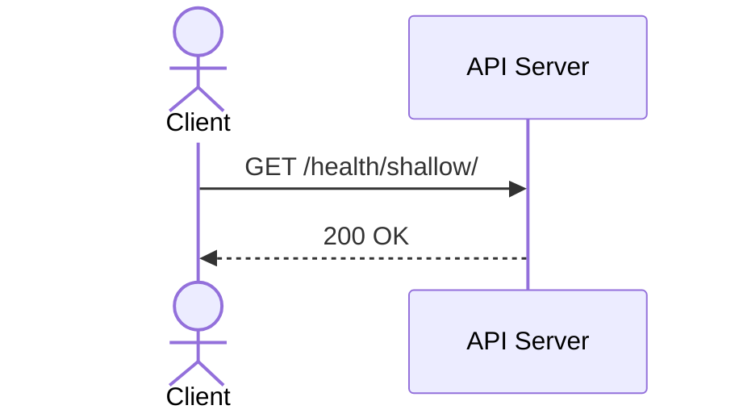
```mermaid
sequenceDiagram
    actor C as Client
    participant S as API Server
    C->>S: GET /health/shallow/
    S-->>C: 200 OK
```

## `GET /health/deep/`

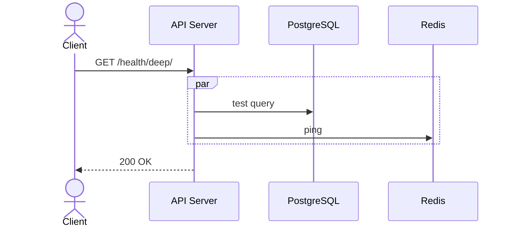
```mermaid
sequenceDiagram
    actor C as Client
    participant S as API Server
    participant DB as PostgreSQL
    participant R as Redis
    C->>S: GET /health/deep/
    par
        S->>DB: test query
        S->>R: ping
    end
    S-->>C: 200 OK
```

## `POST /auth/register`

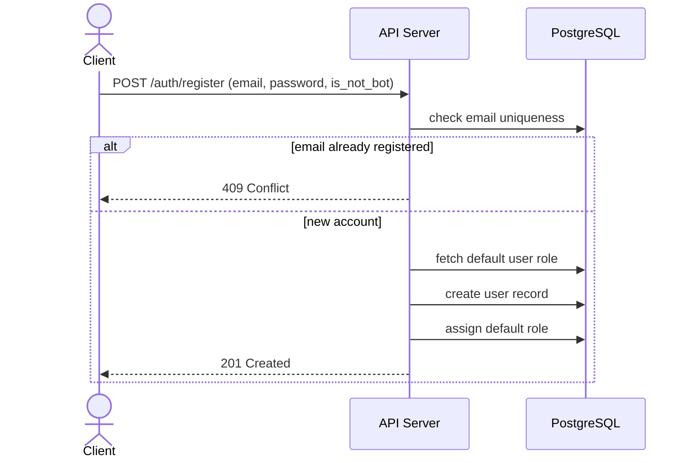
```mermaid
sequenceDiagram
    actor C as Client
    participant S as API Server
    participant DB as PostgreSQL
    C->>S: POST /auth/register (email, password, is_not_bot)
    S->>DB: check email uniqueness
    alt email already registered
        S-->>C: 409 Conflict
    else new account
        S->>DB: fetch default user role
        S->>DB: create user record
        S->>DB: assign default role
        S-->>C: 201 Created
    end
```

## `POST /auth/login`

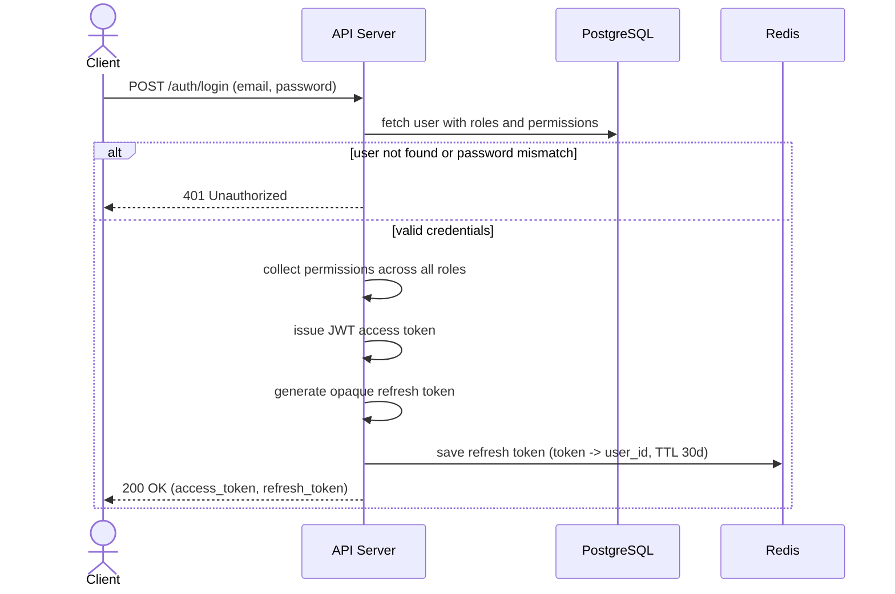
```mermaid
sequenceDiagram
    actor C as Client
    participant S as API Server
    participant DB as PostgreSQL
    participant R as Redis
    C->>S: POST /auth/login (email, password)
    S->>DB: fetch user with roles and permissions
    alt user not found or password mismatch
        S-->>C: 401 Unauthorized
    else valid credentials
        S->>S: collect permissions across all roles
        S->>S: issue JWT access token
        S->>S: generate opaque refresh token
        S->>R: save refresh token (token -> user_id, TTL 30d)
        S-->>C: 200 OK (access_token, refresh_token)
    end
```

## `POST /auth/logout`

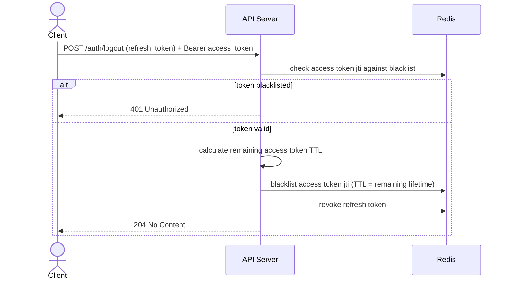
```mermaid
sequenceDiagram
    actor C as Client
    participant S as API Server
    participant R as Redis
    C->>S: POST /auth/logout (refresh_token) + Bearer access_token
    S->>R: check access token jti against blacklist
    alt token blacklisted
        S-->>C: 401 Unauthorized
    else token valid
        S->>S: calculate remaining access token TTL
        S->>R: blacklist access token jti (TTL = remaining lifetime)
        S->>R: revoke refresh token
        S-->>C: 204 No Content
    end
```

## `POST /auth/refresh`

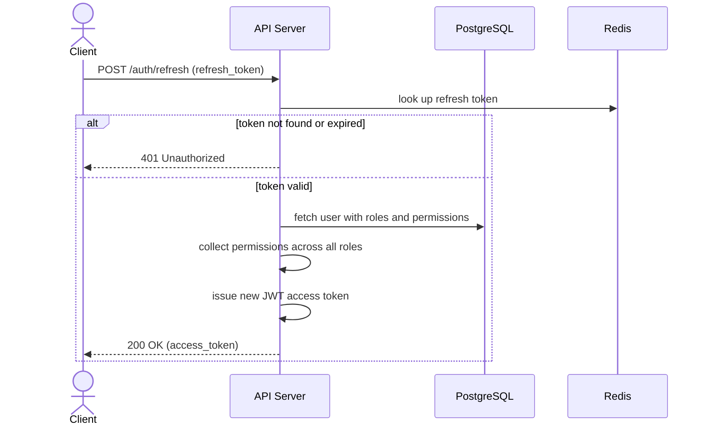
```mermaid
sequenceDiagram
    actor C as Client
    participant S as API Server
    participant DB as PostgreSQL
    participant R as Redis
    C->>S: POST /auth/refresh (refresh_token)
    S->>R: look up refresh token
    alt token not found or expired
        S-->>C: 401 Unauthorized
    else token valid
        S->>DB: fetch user with roles and permissions
        S->>S: collect permissions across all roles
        S->>S: issue new JWT access token
        S-->>C: 200 OK (access_token)
    end
```

## `GET /account/me`

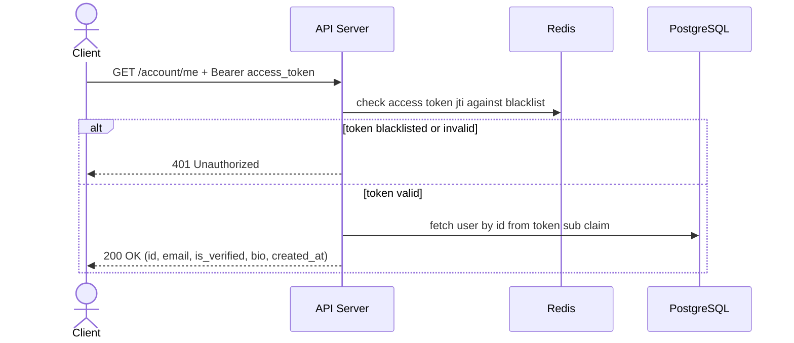
```mermaid
sequenceDiagram
    actor C as Client
    participant S as API Server
    participant R as Redis
    participant DB as PostgreSQL
    C->>S: GET /account/me + Bearer access_token
    S->>R: check access token jti against blacklist
    alt token blacklisted or invalid
        S-->>C: 401 Unauthorized
    else token valid
        S->>DB: fetch user by id from token sub claim
        S-->>C: 200 OK (id, email, is_verified, bio, created_at)
    end
```

## `PATCH /account/change-bio`

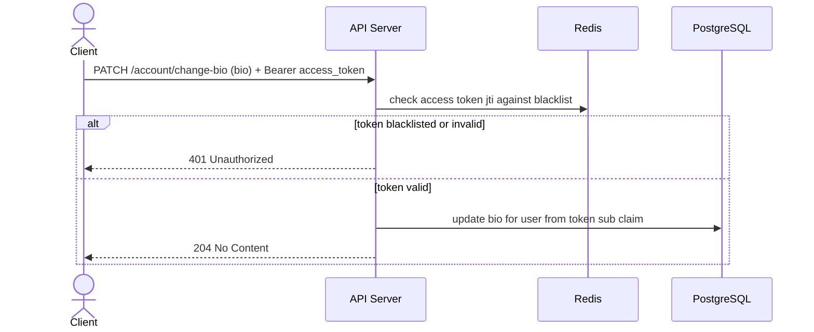
```mermaid
sequenceDiagram
    actor C as Client
    participant S as API Server
    participant R as Redis
    participant DB as PostgreSQL
    C->>S: PATCH /account/change-bio (bio) + Bearer access_token
    S->>R: check access token jti against blacklist
    alt token blacklisted or invalid
        S-->>C: 401 Unauthorized
    else token valid
        S->>DB: update bio for user from token sub claim
        S-->>C: 204 No Content
    end
```

## `PATCH /account/change-password`

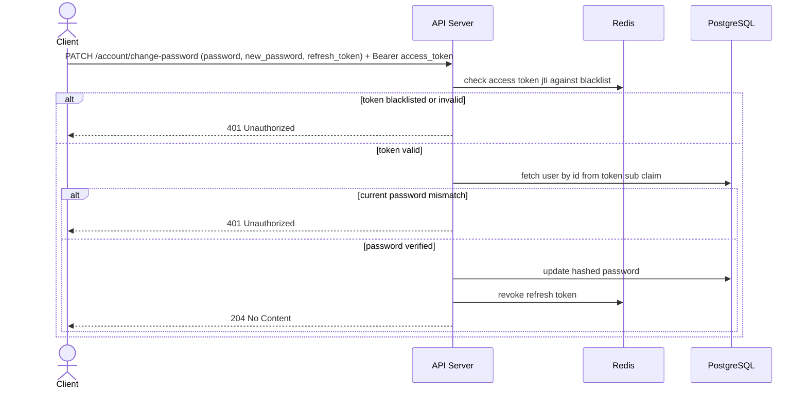
```mermaid
sequenceDiagram
    actor C as Client
    participant S as API Server
    participant R as Redis
    participant DB as PostgreSQL
    C->>S: PATCH /account/change-password (password, new_password, refresh_token) + Bearer access_token
    S->>R: check access token jti against blacklist
    alt token blacklisted or invalid
        S-->>C: 401 Unauthorized
    else token valid
        S->>DB: fetch user by id from token sub claim
        alt current password mismatch
            S-->>C: 401 Unauthorized
        else password verified
            S->>DB: update hashed password
            S->>R: revoke refresh token
            S-->>C: 204 No Content
        end
    end
```

## `GET /admin/users/`

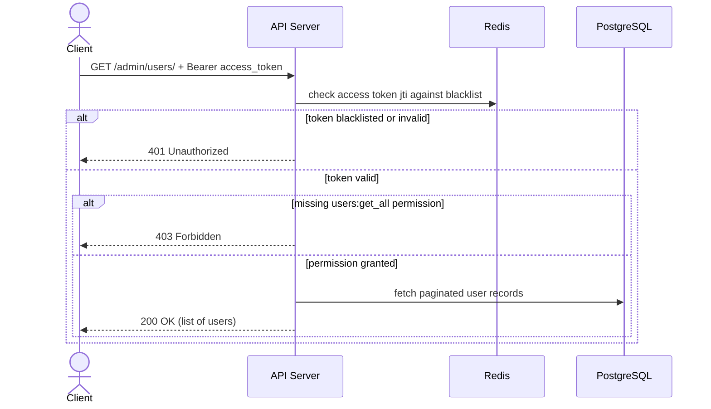
```mermaid
sequenceDiagram
    actor C as Client
    participant S as API Server
    participant R as Redis
    participant DB as PostgreSQL
    C->>S: GET /admin/users/ + Bearer access_token
    S->>R: check access token jti against blacklist
    alt token blacklisted or invalid
        S-->>C: 401 Unauthorized
    else token valid
        alt missing users:get_all permission
            S-->>C: 403 Forbidden
        else permission granted
            S->>DB: fetch paginated user records
            S-->>C: 200 OK (list of users)
        end
    end
```

## `GET /admin/users/{user_id}`

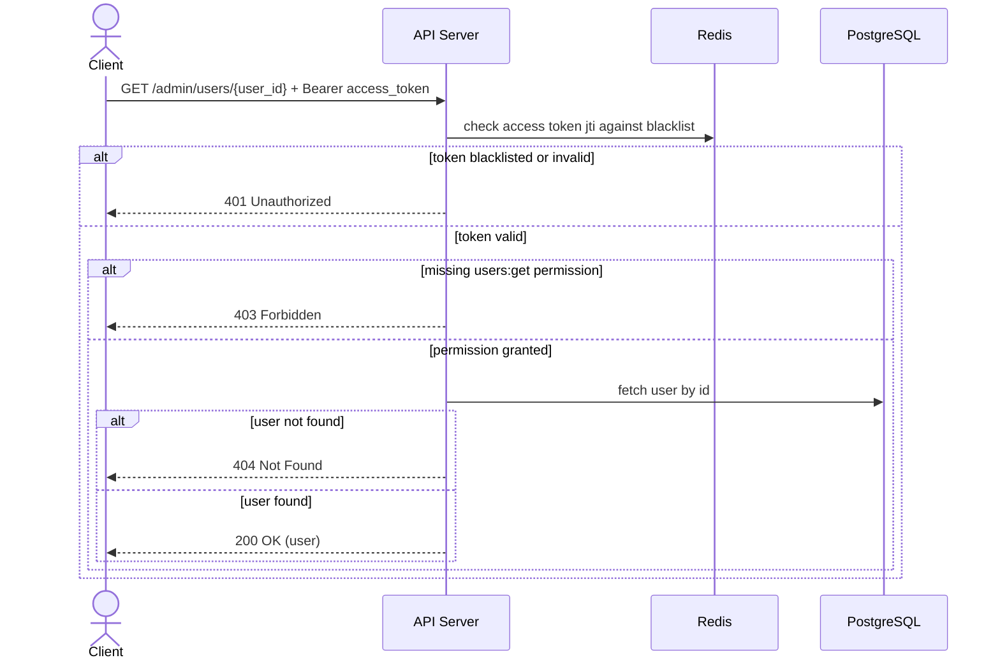
```mermaid
sequenceDiagram
    actor C as Client
    participant S as API Server
    participant R as Redis
    participant DB as PostgreSQL
    C->>S: GET /admin/users/{user_id} + Bearer access_token
    S->>R: check access token jti against blacklist
    alt token blacklisted or invalid
        S-->>C: 401 Unauthorized
    else token valid
        alt missing users:get permission
            S-->>C: 403 Forbidden
        else permission granted
            S->>DB: fetch user by id
            alt user not found
                S-->>C: 404 Not Found
            else user found
                S-->>C: 200 OK (user)
            end
        end
    end
```

## `PATCH /admin/users/{user_id}`

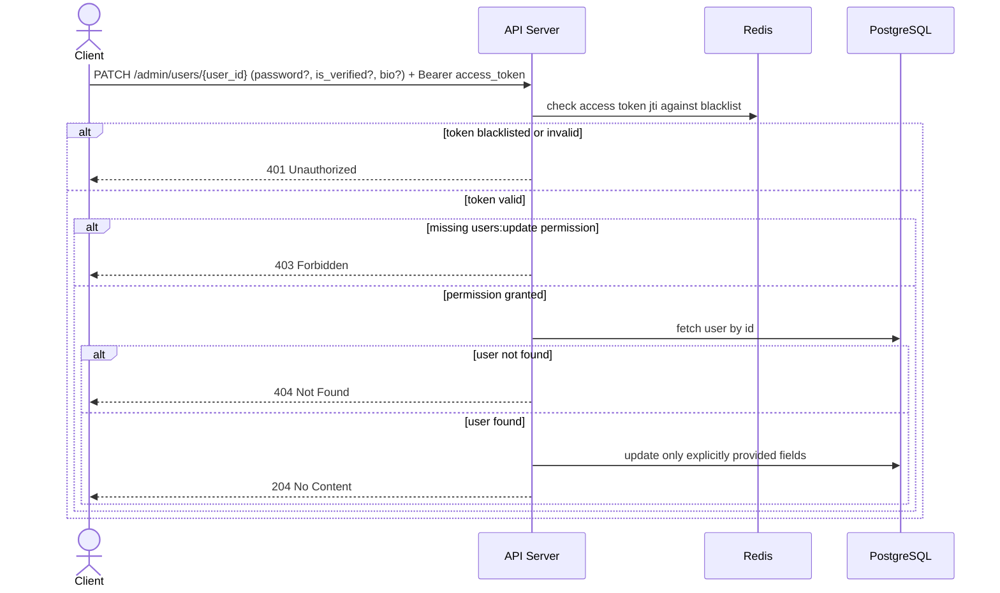
```mermaid
sequenceDiagram
    actor C as Client
    participant S as API Server
    participant R as Redis
    participant DB as PostgreSQL
    C->>S: PATCH /admin/users/{user_id} (password?, is_verified?, bio?) + Bearer access_token
    S->>R: check access token jti against blacklist
    alt token blacklisted or invalid
        S-->>C: 401 Unauthorized
    else token valid
        alt missing users:update permission
            S-->>C: 403 Forbidden
        else permission granted
            S->>DB: fetch user by id
            alt user not found
                S-->>C: 404 Not Found
            else user found
                S->>DB: update only explicitly provided fields
                S-->>C: 204 No Content
            end
        end
    end
```

## `DELETE /admin/users/{user_id}`

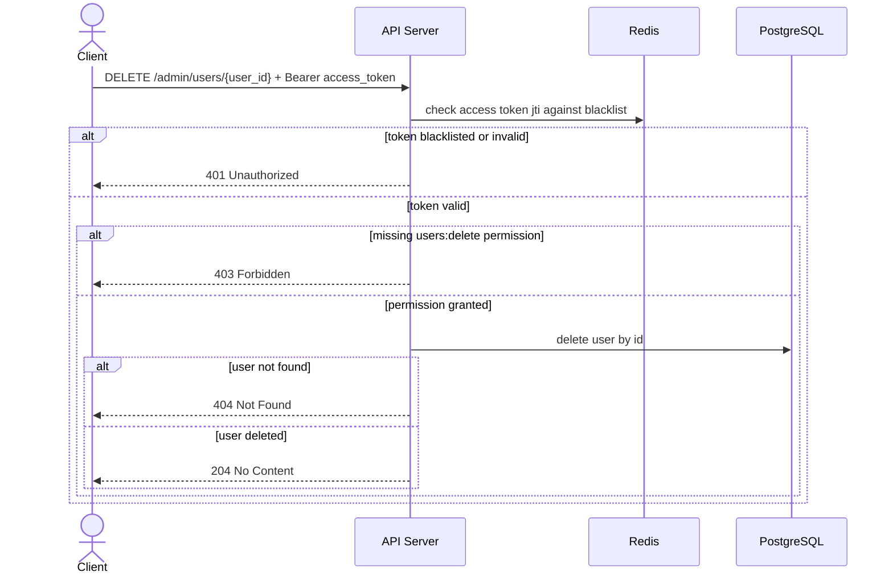
```mermaid
sequenceDiagram
    actor C as Client
    participant S as API Server
    participant R as Redis
    participant DB as PostgreSQL
    C->>S: DELETE /admin/users/{user_id} + Bearer access_token
    S->>R: check access token jti against blacklist
    alt token blacklisted or invalid
        S-->>C: 401 Unauthorized
    else token valid
        alt missing users:delete permission
            S-->>C: 403 Forbidden
        else permission granted
            S->>DB: delete user by id
            alt user not found
                S-->>C: 404 Not Found
            else user deleted
                S-->>C: 204 No Content
            end
        end
    end
```

## `POST /admin/users/{user_id}/roles`

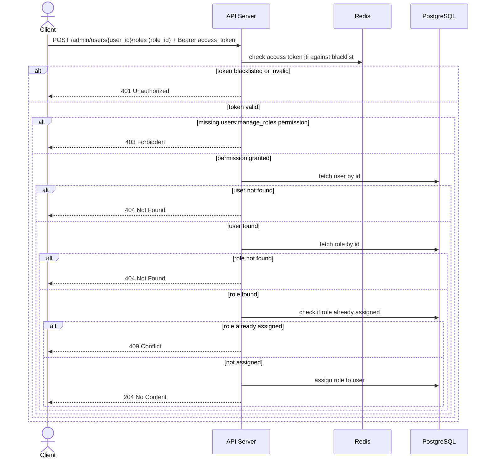
```mermaid
sequenceDiagram
    actor C as Client
    participant S as API Server
    participant R as Redis
    participant DB as PostgreSQL
    C->>S: POST /admin/users/{user_id}/roles (role_id) + Bearer access_token
    S->>R: check access token jti against blacklist
    alt token blacklisted or invalid
        S-->>C: 401 Unauthorized
    else token valid
        alt missing users:manage_roles permission
            S-->>C: 403 Forbidden
        else permission granted
            S->>DB: fetch user by id
            alt user not found
                S-->>C: 404 Not Found
            else user found
                S->>DB: fetch role by id
                alt role not found
                    S-->>C: 404 Not Found
                else role found
                    S->>DB: check if role already assigned
                    alt role already assigned
                        S-->>C: 409 Conflict
                    else not assigned
                        S->>DB: assign role to user
                        S-->>C: 204 No Content
                    end
                end
            end
        end
    end
```

## `DELETE /admin/users/{user_id}/roles`

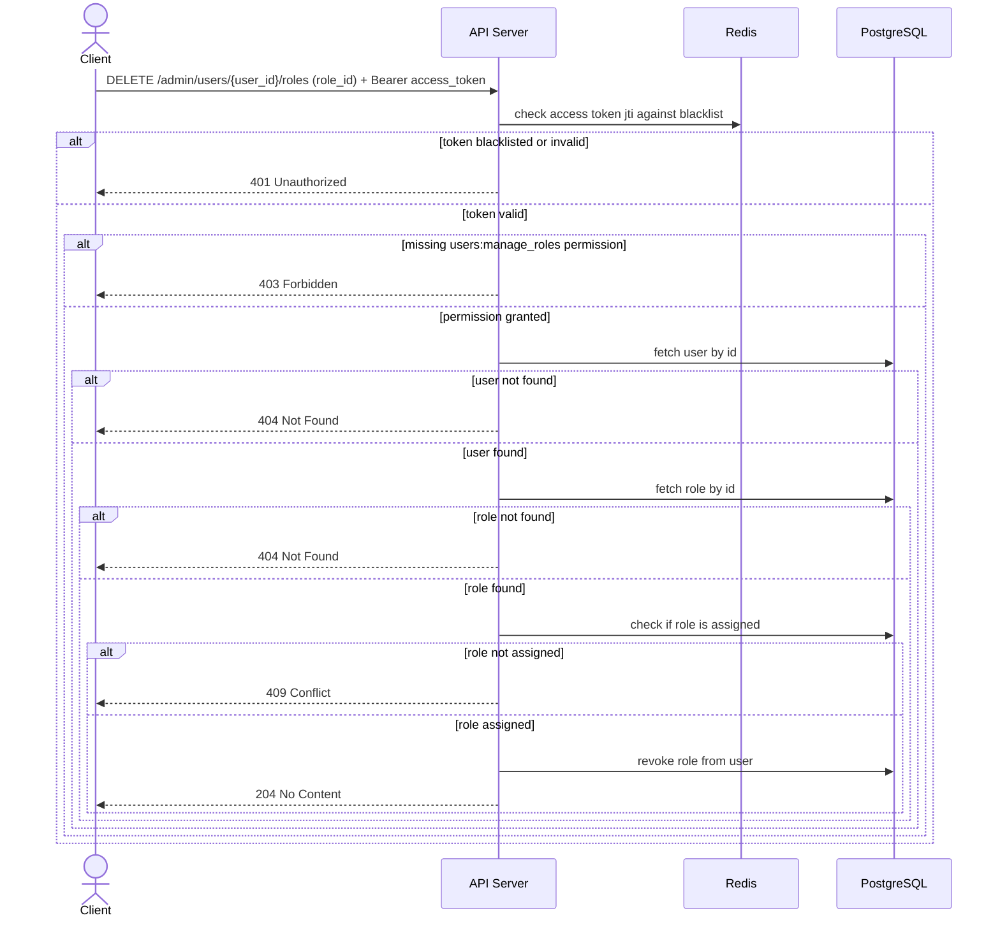
```mermaid
sequenceDiagram
    actor C as Client
    participant S as API Server
    participant R as Redis
    participant DB as PostgreSQL
    C->>S: DELETE /admin/users/{user_id}/roles (role_id) + Bearer access_token
    S->>R: check access token jti against blacklist
    alt token blacklisted or invalid
        S-->>C: 401 Unauthorized
    else token valid
        alt missing users:manage_roles permission
            S-->>C: 403 Forbidden
        else permission granted
            S->>DB: fetch user by id
            alt user not found
                S-->>C: 404 Not Found
            else user found
                S->>DB: fetch role by id
                alt role not found
                    S-->>C: 404 Not Found
                else role found
                    S->>DB: check if role is assigned
                    alt role not assigned
                        S-->>C: 409 Conflict
                    else role assigned
                        S->>DB: revoke role from user
                        S-->>C: 204 No Content
                    end
                end
            end
        end
    end
```

## `GET /admin/roles/`

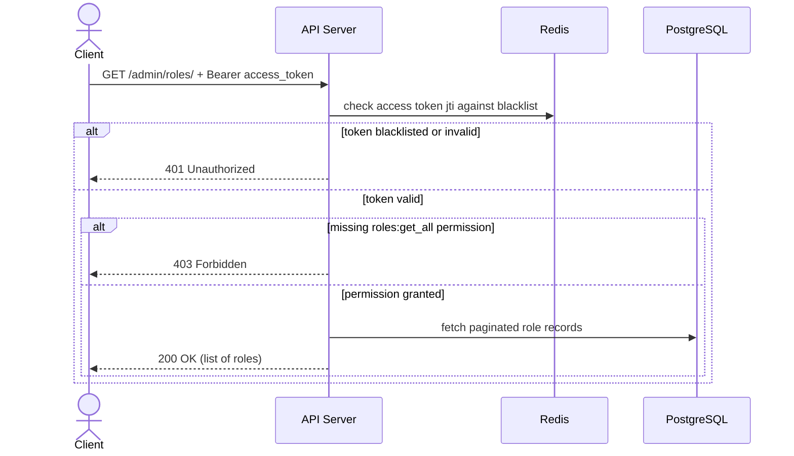
```mermaid
sequenceDiagram
    actor C as Client
    participant S as API Server
    participant R as Redis
    participant DB as PostgreSQL
    C->>S: GET /admin/roles/ + Bearer access_token
    S->>R: check access token jti against blacklist
    alt token blacklisted or invalid
        S-->>C: 401 Unauthorized
    else token valid
        alt missing roles:get_all permission
            S-->>C: 403 Forbidden
        else permission granted
            S->>DB: fetch paginated role records
            S-->>C: 200 OK (list of roles)
        end
    end
```

## `GET /admin/roles/{role_id}`

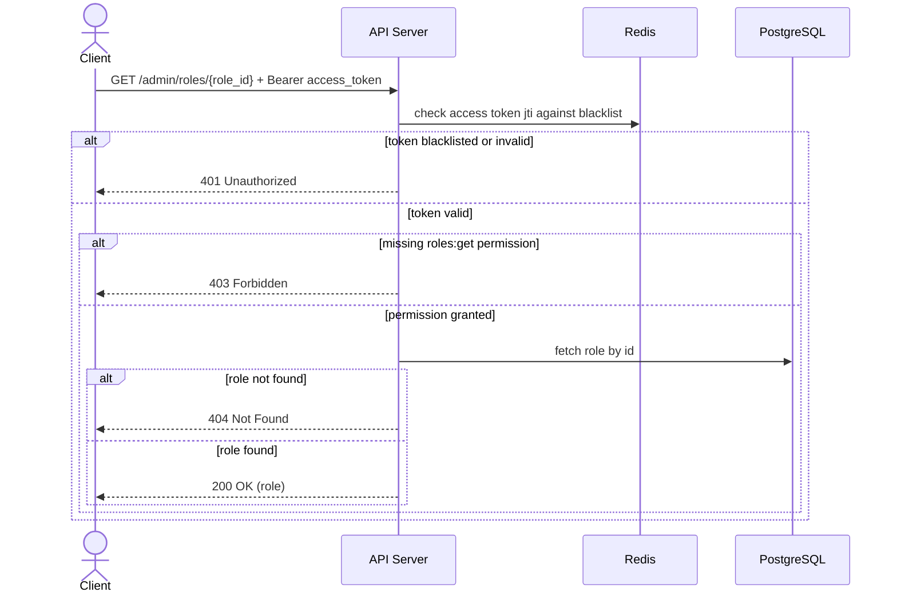
```mermaid
sequenceDiagram
    actor C as Client
    participant S as API Server
    participant R as Redis
    participant DB as PostgreSQL
    C->>S: GET /admin/roles/{role_id} + Bearer access_token
    S->>R: check access token jti against blacklist
    alt token blacklisted or invalid
        S-->>C: 401 Unauthorized
    else token valid
        alt missing roles:get permission
            S-->>C: 403 Forbidden
        else permission granted
            S->>DB: fetch role by id
            alt role not found
                S-->>C: 404 Not Found
            else role found
                S-->>C: 200 OK (role)
            end
        end
    end
```

## `POST /admin/roles/`

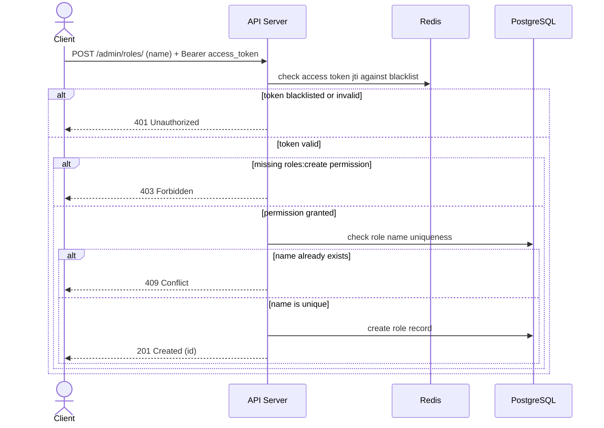
```mermaid
sequenceDiagram
    actor C as Client
    participant S as API Server
    participant R as Redis
    participant DB as PostgreSQL
    C->>S: POST /admin/roles/ (name) + Bearer access_token
    S->>R: check access token jti against blacklist
    alt token blacklisted or invalid
        S-->>C: 401 Unauthorized
    else token valid
        alt missing roles:create permission
            S-->>C: 403 Forbidden
        else permission granted
            S->>DB: check role name uniqueness
            alt name already exists
                S-->>C: 409 Conflict
            else name is unique
                S->>DB: create role record
                S-->>C: 201 Created (id)
            end
        end
    end
```

## `DELETE /admin/roles/{role_id}`

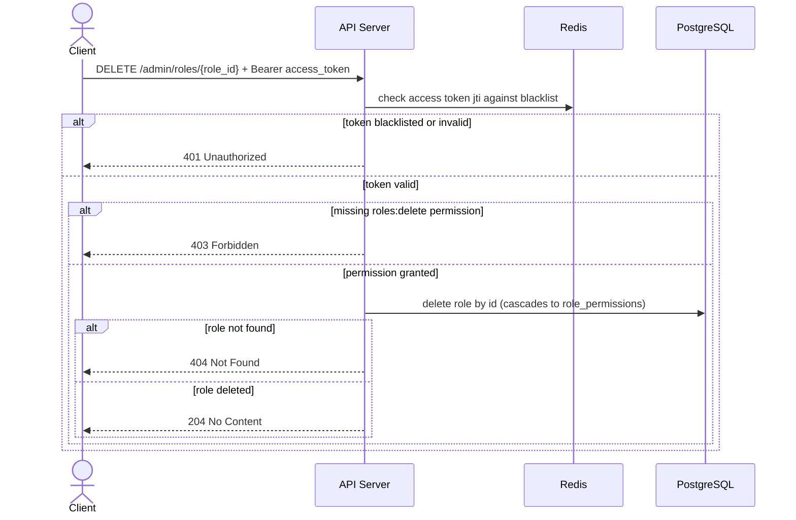
```mermaid
sequenceDiagram
    actor C as Client
    participant S as API Server
    participant R as Redis
    participant DB as PostgreSQL
    C->>S: DELETE /admin/roles/{role_id} + Bearer access_token
    S->>R: check access token jti against blacklist
    alt token blacklisted or invalid
        S-->>C: 401 Unauthorized
    else token valid
        alt missing roles:delete permission
            S-->>C: 403 Forbidden
        else permission granted
            S->>DB: delete role by id (cascades to role_permissions)
            alt role not found
                S-->>C: 404 Not Found
            else role deleted
                S-->>C: 204 No Content
            end
        end
    end
```

## `POST /admin/roles/{role_id}/permissions`

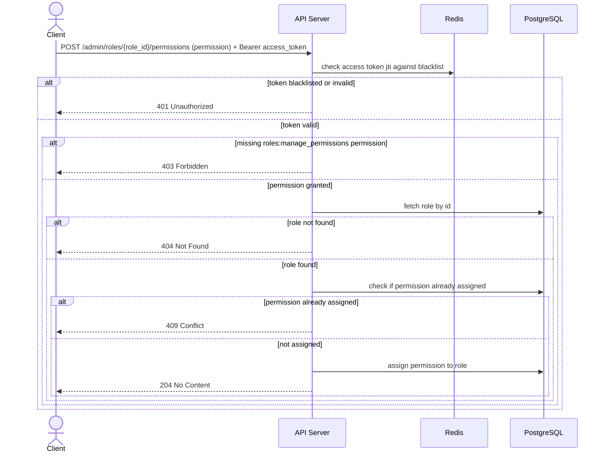
```mermaid
sequenceDiagram
    actor C as Client
    participant S as API Server
    participant R as Redis
    participant DB as PostgreSQL
    C->>S: POST /admin/roles/{role_id}/permissions (permission) + Bearer access_token
    S->>R: check access token jti against blacklist
    alt token blacklisted or invalid
        S-->>C: 401 Unauthorized
    else token valid
        alt missing roles:manage_permissions permission
            S-->>C: 403 Forbidden
        else permission granted
            S->>DB: fetch role by id
            alt role not found
                S-->>C: 404 Not Found
            else role found
                S->>DB: check if permission already assigned
                alt permission already assigned
                    S-->>C: 409 Conflict
                else not assigned
                    S->>DB: assign permission to role
                    S-->>C: 204 No Content
                end
            end
        end
    end
```

## `DELETE /admin/roles/{role_id}/permissions`

```mermaid
sequenceDiagram
    actor C as Client
    participant S as API Server
    participant R as Redis
    participant DB as PostgreSQL
    C->>S: DELETE /admin/roles/{role_id}/permissions (permission) + Bearer access_token
    S->>R: check access token jti against blacklist
    alt token blacklisted or invalid
        S-->>C: 401 Unauthorized
    else token valid
        alt missing roles:manage_permissions permission
            S-->>C: 403 Forbidden
        else permission granted
            S->>DB: fetch role by id
            alt role not found
                S-->>C: 404 Not Found
            else role found
                S->>DB: check if permission is assigned
                alt permission not assigned
                    S-->>C: 409 Conflict
                else permission assigned
                    S->>DB: revoke permission from role
                    S-->>C: 204 No Content
                end
            end
        end
    end
```